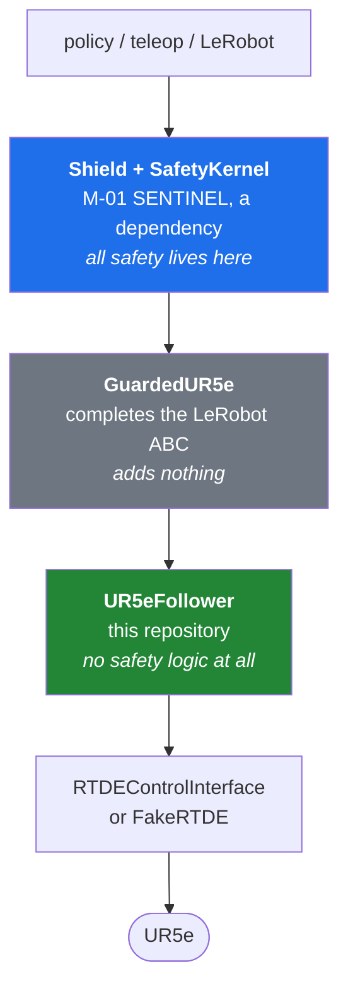

# M-03 KEYSTONE

**A UR5e LeRobot driver that contains no safety logic, and the proof that nothing gets past the layer in front of it.**

[](https://github.com/tarekokashha/mizan-keystone/actions/workflows/ci.yml)
[](LICENSE)
[](pyproject.toml)

This repository does two things. It replaces a driver skeleton that was never
a working LeRobot plugin with one that is. And it composes that driver with
[M-01 SENTINEL](https://github.com/tarekokashha/mizan-sentinel)'s safety
kernel and tests the seam between them, which is the thing neither programme
could test about itself.

The second is why it exists. M-01 shipped with this stated limitation:

> The Shield has never been composed with the driver it exists to wrap. Every
> Shield test runs against a fake implementing the LeRobot dict contract, so
> what is verified is that the Shield honours that contract, not that the real
> driver honours it too, or that the composition works end to end.

A safety kernel that has never been attached to a driver is a safety kernel
with an untested assumption at its most important seam. Attaching it found
two defects that were invisible from either side, and both are described
below in full.

---

## Contents

- [The claims](#the-claims)
- [The architecture, and the subtraction at the centre of it](#the-architecture-and-the-subtraction-at-the-centre-of-it)
- [What composition found](#what-composition-found)
- [Results](#results)
- [Quick start](#quick-start)
- [How to verify any claim here yourself](#how-to-verify-any-claim-here-yourself)
- [Repository layout](#repository-layout)
- [What this does not do](#what-this-does-not-do)
- [Prior art](#prior-art)

---

## The claims

Two, deliberately separated, because one is a property of software and the
other is a property of a particular machine.

> **(A) Authorisation, exact.** No action reaches the RTDE control interface
> that the SENTINEL kernel did not authorise. For any sequence of policy
> actions, including malformed and adversarial ones, every value passed to
> `servoJ` is a value the kernel emitted, unmodified.

Falsifiable by a single counterexample, and tested exhaustively offline
against all fifteen attacks in SENTINEL's catalogue. Bit-identity is
asserted with `numpy.array_equal`, never `allclose`: a tolerance here would
be a tolerance on whether the safety layer was bypassed, and that is not a
thing that admits tolerance.

> **(B) Timing, measured.** The control loop sustains a rate and jitter that
> are measured on the platform under test and reported, not asserted in
> advance.

(B) is a measurement and is not falsifiable. It can be reported dishonestly,
which is what [PROTOCOL.md](PROTOCOL.md) exists to prevent. Half of it is
currently unmeasured, and the README says so in
[Results](#results) rather than in a footnote.

---

## The architecture, and the subtraction at the centre of it



The central design decision is a subtraction.

The vendor skeleton's `send_action` contained six defects, **all of them
safety logic**: a velocity clamp wrong by the ratio of two rates, no position
limits, an unsound force check, no finiteness validation, no watchdog, and no
cumulative guard.

**None of them are fixed here. They are removed.** The driver's job is to
move the arm and report its state. Safety is the Shield's job, and the Shield
is already built, reviewed and measured.

That is the architectural claim: **safety does not belong in the vendor
driver's diff.** A driver carrying its own half-correct clamps is worse than
one carrying none, because it invites the reader to trust it. It also keeps
the driver small enough to be obviously correct, which is the only kind of
correct that matters at this layer.

The claim is enforced, not just stated. `send_action` does three things: take
the action, call `servoJ`, return what was sent. A test drives an action of
magnitude `1e9`, a value that would destroy the arm, and asserts it reaches
`servoJ` unmodified. If you add a clamp, that test fails, and it is supposed
to.

---

## What composition found

Both defects below were invisible from inside either repository. Each was
found by attaching the two together, which is the entire thesis of this
programme.

### 1. The Shield was not a LeRobot plugin either

`sentinel.shield.Shield` does not subclass `lerobot.robots.Robot`, and
implements eight of the ten abstract members it declares. The two missing
are `configure` and `is_calibrated`, **exactly** the two the vendor
skeleton was missing, which is the defect this repository was chartered to
fix one layer down.

```
Shield subclasses lerobot Robot: False
Shield MRO: ['Shield', 'object']
Shield missing : configure, is_calibrated
```

So M-01 reproduced, in the safety layer, the precise defect M-03 exists to
fix in the driver layer.

**Why M-01 could not have caught it.** Every Shield test ran against a fake
built to the LeRobot dict contract, and a dict-contract fake performs no
abstract-API check. The probe silently encoded the absence of the very check
that would have caught it.

`GuardedUR5e` closes it by completing the ABC through delegation, adding no
safety logic, so claim (A) stays a claim about the kernel rather than about
an adapter.

**It is also now fixed upstream.** M-01 SENTINEL's `Shield` implements all
ten members, and `sentinel.lerobot_plugin.ShieldRobot` provides a real
`Robot` subclass behind an optional extra. The Shield still does not inherit
from `Robot`, deliberately: inheriting would make a large ML stack a hard
runtime dependency of a numpy-only safety kernel. So `GuardedUR5e` keeps its
place here, where `lerobot` is a dependency already.

The test that pinned the original defect was written to fail the day it was
fixed. It did, on the first run after the upstream change landed, and it now
asserts both halves of the new state instead of being deleted. Full record:
[docs/decisions/task-4-shield-is-not-a-lerobot-plugin.md](docs/decisions/task-4-shield-is-not-a-lerobot-plugin.md).

### 2. The staleness guard was blind through the real driver

SENTINEL's guard 2 asks one question: is the driver's observation stamp
advancing. The driver answered with `time.perf_counter()`, the host clock,
which advances whether or not the RTDE stream does. A controller whose
stream had stalled still produced a stamp marching forward, so `stale` could
never fire.

Measured, with the joint data held still:

```
joint data identical across reads: True
stamp strictly increasing        : True
```

and through the composition, `stale_replay` fired `qdd_max`, `qddd_max`,
`tcp_box` and `tcp_speed`, and never `stale`, the guard it declares.

**Why neither programme could have caught it alone.** M-01's fake driver
could freeze its own stamp, because the fake owned it. A real driver reading
a host clock cannot. The probe was able to express a stall that the shipped
driver could never produce, so the guard passed its test and was inert in
the field.

The driver now stamps from `RTDEReceiveInterface.getTimestamp()`, the
controller's own sample clock, which stands still exactly when the stream
does. This was not a safety hole on its own, since the tracking guard still
saw commanded and actual diverge, but it meant one of ten declared guards
was decorative in any real deployment. A guard that cannot fire is worse
than a missing one, because the envelope table claims it is there. Full
record:
[docs/decisions/task-4-staleness-is-blind.md](docs/decisions/task-4-staleness-is-blind.md).

### The pattern

Both are the same lesson, which M-01 wrote into its own contributing guide
and then demonstrated twice more here:

> Measuring a component does not validate the composition. A probe written
> before a guard exists silently encodes that guard's absence as an
> assumption.

---

## Results

### Claim (A): authorisation

| | |
|---|---|
| Attacks driven through the composed stack | **15 of 15** |
| Control steps driven | **7600** |
| `servoJ` commands checked | **7600** |
| Bit-identical to the kernel's emission | **all of them** |
| Commands reaching `servoJ` unauthorised | **0** |
| Declared guards that fire through the composition | **14 of 15** |

The one exemption is `force_max`, and its premise is **asserted rather than
claimed**: `FakeReceive.getActualTCPForce()` returns a zero wrench because no
contact physics is modelled, so the guard has nothing to measure. Closing it
needs a contact model, URSim, or an arm. The test asserts the zero wrench
rather than describing it, so the exemption rests on a fact.

When the kernel authorises nothing, nothing reaches the driver. That includes
the case M-01 had to fix: a non-finite **first** observation once caused a
fabricated zero pose to be emitted. Through this composition it produces zero
`servoJ` calls, verified for both `nan` and `inf`.

### Claim (B): timing

Measured against harness `3f9e5fb` at the budget pre-registered in
[PROTOCOL.md](PROTOCOL.md), on the platform recorded there. All three repeats
reported, none discarded.

```
run                         rate Hz     p50 us     p99 us   p99.9 us     max us
driver_only r1              21353.5      39.20     112.80     290.11  140069.70
composed r1                  1303.1     776.60    1754.33    3874.60  135282.40
driver_only r2              19654.9      34.80      96.11     284.10  161196.70
composed r2                  1489.9     671.95    1353.30    3457.52  131610.90
driver_only r3              22870.4      36.40     123.70     361.10  127086.00
composed r3                  1398.0     723.50    1489.58    3654.50  141908.30
```

**The safety layer costs 0.64 ms to 0.74 ms per cycle at the median.** That
number had never been quantified before. The composed stack sustains 1303 to
1490 Hz on software cost alone, so the kernel is not too slow to sit inside a
control loop, and at the configured 125 Hz even its p99.9 fits inside the
period with room left.

**The finding is in the tail.** A 500 Hz period is 2000 us and the composed
p99.9 is 3457 to 3875 us in every repeat. The vendor kit declares a CI gate
of "rate >= 480 Hz, p99.9 jitter < 2500 us on a laptop", written without
running it on a platform that was not specified. Measured here, the rate half
passes comfortably and **the p99.9 half fails in all three repeats.**

Per [PROTOCOL.md](PROTOCOL.md) section 6, that gate is not relaxed and no
gate is adopted. It is reported as a finding about this platform. And the
figure is the software cost against a fake, so the real number including
RTDE can only be worse.

**The extreme tail belongs to the platform, not the kernel.** Max is 127 to
161 ms, and it is the same order in the *driver-only* runs as in the composed
ones. A bare driver doing almost nothing shows the same 100 ms outliers, so
they are the operating system descheduling the process. That attribution is
only available because both configurations were measured; timing the composed
stack alone would have blamed the safety layer for them.

### Claim (B), the controller half: measured on CI

On the development host Docker Desktop's processes run while its CLI never
answers, so URSim could not be started there and the suite skips with a
reason. CI has a working engine, so the measurement was taken there rather
than left undone. URSim boots, the arm is powered on through the dashboard,
and RTDE is read from a real UR controller:

```
URSim ready: RTDE session established after 4 attempts
URSim powered: robot mode Robotmode: RUNNING
  samples              : 2000
  wall elapsed s       : 2.148188
  read rate Hz         : 931.0
  controller dt p50 s  : 0.008000
  read gap p50 us      : 1072.45
```

**The figure that means what it looks like is `controller dt p50`: 0.008000
s, exactly 125 Hz.** That is the controller's own sample period, read from
its own clock, and it independently confirms that the rate
`UR5eConfig.declared()` carries is the rate a real controller serves.

**The read gap figures do not measure RTDE latency.** The sampling loop
holds a deliberate 1 ms sleep, so a p50 of 1072 us is that sleep plus
overhead and describes this test's pacing, not the controller's. The sleep
exists because an earlier attempt read 2000 timestamps in a few
milliseconds, landed inside a single controller sample, and concluded the
stream was frozen when it was only slower than the reader.

**Still unmeasured: the control direction.** `RTDEControlInterface` uploads
a control script and needs the pendant in remote control mode, which
headless URSim does not offer, so `servoJ` has never been issued to a
controller. Claim (A) rests on the deterministic fake alone. See
[LIMITATIONS.md](LIMITATIONS.md).

---

## Quick start

Windows, PowerShell, from the repository root:

```powershell
py -3.11 -m venv .venv
.\.venv\Scripts\python.exe -m pip install -e ".[test]"
.\tasks.ps1 test
```

Linux or macOS:

```bash
python3.11 -m venv .venv
.venv/bin/python -m pip install -e ".[test]"
.venv/bin/python -m pytest -q
```

The whole suite runs offline. No hardware, no Docker, no network. That is
deliberate: without it, every test would need a container and a 500 Hz
socket, which is how a project ends up with a driver nobody tests.

---

## How to verify any claim here yourself

Nothing in this README asks to be taken on trust. Each of these is a command.

| To check | Run |
|---|---|
| Claim (A), all fifteen attacks | `.\tasks.ps1 guarded` |
| The timing distribution, reproduced | `.\tasks.ps1 timing` |
| Whether URSim can run on your machine, and why not | `.\tasks.ps1 docker` |
| Everything | `.\tasks.ps1 test` |

**The claims are falsifiable, and were falsified on purpose before being
believed.** Every load-bearing assertion in this repository was verified by
mutation: the code was broken deliberately, the test was confirmed to fail,
and the break was reverted and re-verified by hash. A test that has never
been seen to fail is not evidence. Some examples, with the observed output:

Bypass the Shield so raw actions reach the driver:

```
AssertionError: slam_to_limit step 0: servoJ received
  [100. 100. 100. -100. -100. -100.] but the kernel emitted
  [0. -1.2 1.2 -1.5 -1.5708 0.]
```

Restore the host-clock stamp:

```
AssertionError: the driver stamp still advances while the RTDE stream is
  stalled; it is reading a host clock again
```

Put a clamp back into `send_action`:

```
assert [3.14, 3.14, ...] == [1000000000.0, ...]
At index 0 diff: 3.14 != 1000000000.0
```

Add a threshold to the timing module:

```
AssertionError: keystone/timing.py has grown a pass/fail rule
```

---

## Repository layout

```
mizan-keystone/
  PROTOCOL.md        pre-registration, committed before the timing run
  LIMITATIONS.md     what this does not establish
  keystone/
    config.py        UR5eConfig: connection and servo parameters, with provenance
    rtde_fake.py     deterministic fake of the three ur_rtde interfaces
    follower.py      UR5eFollower: a real LeRobot plugin, no safety logic
    guarded.py       GuardedUR5e: the composition, and claim (A)
    timing.py        rate and jitter, measured and reported, never gated
    ursim.py         URSim lifecycle, skipping cleanly when Docker is absent
  tests/
  results/           measured distributions
  docs/decisions/    defects found, and what was done about them
  docs/superpowers/  the design and the plan, committed before the code
```

### Why `rtde_fake.py` matters more than it looks

It is what makes this testable on Windows with no hardware, so claim (A) is
exhaustive, offline and fast. Its fidelity is therefore load bearing: a fake
more permissive than the real interface turns every green test into a false
negative. Its arity is checked against the installed `ur_rtde` for all
eighteen methods the driver uses, by parsing the real docstrings, because
`ur_rtde` is a pybind11 extension and `inspect.signature` does not work on
it. The check fails loudly if `inspect.signature` ever starts working, rather
than silently going quiet.

---

## What this does not do

Stated plainly, because a safety repository that oversells itself is worse
than one that does nothing.

- **It does not touch hardware, and it never has.** Every number here is
  software timing or a simulated trajectory.
- **It does not run adversarial instructions against a real arm.** The MIZAN
  operating contract forbids it until the controller enforces envelopes in
  hardware, and that gate still stands.
- **It does not measure end-to-end RTDE timing.** URSim was unreachable.
- **It does not validate the envelope values themselves.** They are
  `declared`, not `measured`; only a human may mark a value `measured`.
- **A green suite here does not mean the arm is safe.** It means no action
  from a catalogue of fifteen attacks got past the kernel in simulation, on
  a plant model that is not the arm.

[LIMITATIONS.md](LIMITATIONS.md) is the complete list and is worth reading
before citing anything here.

---

## Prior art

The vendor skeleton's header names three community UR plugins as prior art
to credit and consolidate. They are cited, not copied: this plugin is written
against the installed `lerobot` base class directly, with a test that fails
if the installed version's abstract API changes.

`lerobot` is pinned at 0.4.4 and the pin is recorded, because the plugin
contract moves between releases and the skeleton's own header says so.

---

## Licence

MIT. See [LICENSE](LICENSE).
